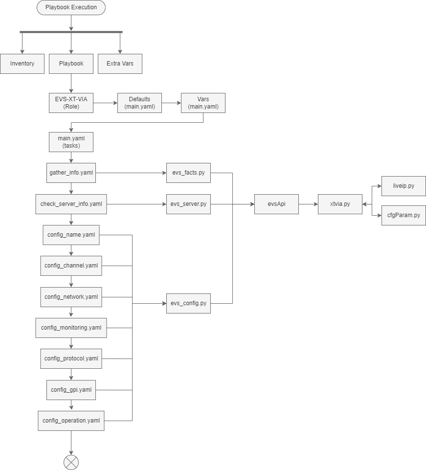

# One Touch EVS Commissioning

The purpose of this toolkit is that it will create a deployment to be one touch commissioning on XT-VIA servers based on pre-build variables.

## Navigation

[docs](docs)

[ExampleResponses] (/ExampleResponses)

[playbooks](playbooks.py.md)

[roles](roles)

[show_vars](show_vars/testing.yaml.md)

[requirements.txt](requirements.txt.md)

## Bounds and Limits

This tools kit will be limited to things it can do/execute over standard and "safe" methods.
This is designed for the EVS and Technology Teams to commission systems, it is not intended to be used for everyday use and is still in work.

We may work to expand this to cover Big shows as well, but that is going to be highly watched.

## Architecture

The idea is to lean on ansible for the majority of the work, but useing a custom python moodule so we can build in some custom handling of different types of parameters and large scale deployment.
A a high level we lean on the trucks inventory files that gives us a list of the servers in use. See the `inventories` folder for some examples and then we run the `playbooks/xt-via-setup.yaml` to do the work.
This calls the `evs-xt-via` role handels most of the tasks and work. 


## Useage

This can be run with something like

```bash
ansible-playbook -i inventories/1052-evs-testbench/evsTestbench.yml playbooks/xt-via-setup.yaml --extra-vars @show_vars/TESTING.yaml
```
To put it variablized it would be
```bash
ansible-playbook -i <TRUCK INVENTORY YOU ARE USING> playbooks/xt-via-setup.yaml --extra-vars @show_vars/<SHOW VARIABLE FILE>
``` 


## High Level Calls Workflows
We don't exactly call out all of the details about the exact changes.



