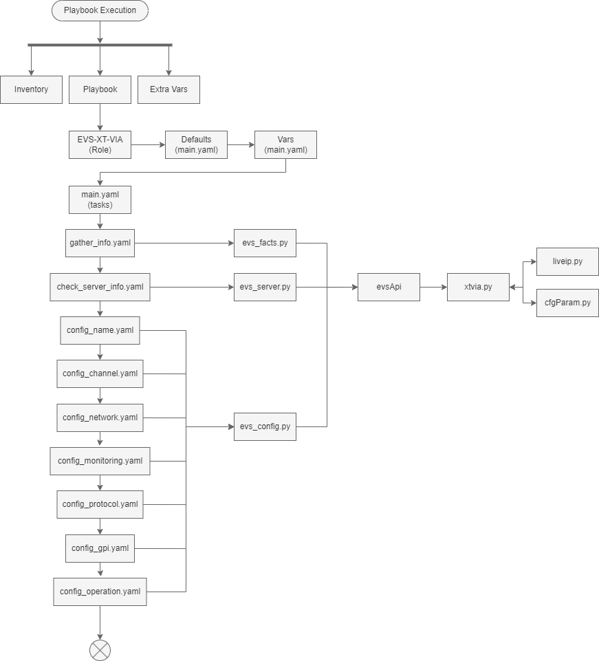

# One Touch EVS Commissioning

The purpose of this toolkit is that it will create a deployment to be one touch commissioning on XT-VIA servers based on pre-build variables and known patterns, such as Live IP multicast addresses. GCV Does a lot of pre-planning on its builds with detailed documentation on each signal and flow which makes it easy to extract that information and use it in this toolkit.

[defaults](/defaults/main.yaml.md)

[docs](/docs)

[library](/library)

[meta](/meta/main.yaml.md)

[module_utils](/module_utils)

[docs](/docs)

[ExampleResponses] (/ExampleResponses)

[playbooks](/playbooks.py.md)

[roles](/roles)

[show_vars](/show_vars/testing.yaml.md)

[requirements.txt](/requirements.txt.md)


## Bounds and Limits

This tools kit will be limited to things it can do/execute over standard and "safe" methods.
This is designed for the Game Creek Video EVS and Technology Teams to commission systems, it is not intended to be used for everyday use and is still a work in progress.

We may work to expand this to cover Big shows as well, but that is going to be highly monitored and carefully tested.

## Architecture

The idea is to lean on ansible for the majority of the work, but useing a custom python moodule so we can build in some custom handling of different types of parameters and large scale deployment.
A a high level we lean on the trucks inventory files that gives us a list of the servers in use. See the `inventories` folder for some examples and then we run the `playbooks/XT-VIA/xt-via-setup.yaml` to do the work.
This calls the `evs-xt-via` role handels most of the tasks and work.

### evs-xt-via Role

Within the role there are multiple blocks of tasks, setting every parameter on the server, including the Live IP configs where appropriate. The majority of these tasks call the `evs_config` module to do the work.

### evs_config Module

This module is the interaction between Ansible and the `evsApi` to do the work. It gets information from the user like, the PC Lan address, the config line number and the parameter you want to modify, as well as the desired value. It then builds an `xtviaServer` object with inspection into the server that gives us a good look at the current config of the server. Then the module checks if a change is needed and if so it will make it otherwise marking it good. 

### evsApi

This is a python module holding the `xtviaServer` class which is the brain of the operation, it is capable of setting all the parameters on the server. It uses a `configLine` class to hold information about the line and the paramters for that line. As well as a `LiveIP` class to hold the information about the Live IP config for each line.


## Useage

This can be run with something like

```shell
ansible-playbook -i inventories/1052-evs-testbench/evsTestbench.yml playbooks/XT-VIA/xt-via-setup.yaml --extra-vars @show_vars/TESTING.yaml
```
To put it variablized it would be
```shell
ansible-playbook -i <TRUCK INVENTORY YOU ARE USING> playbooks/XT-VIA/xt-via-setup.yaml --extra-vars @show_vars/<SHOW VARIABLE FILE>
``` 


## High Level Calls Workflows
We don't exactly call out all of the details about the exact changes.



The idea behind this is that ansible interfaces with the `evs_config` or `evs_server` modules which are then building and interacting with the `evsApi` which is the performer behind all of this. 


## Current Challenges

1. Merging and Meshing Variables, its not a perfect science, I can see a world where there are global, server, and configline inheritance rules. Like when doing most shows its going to be all the same format across the system, but that should not be a limitation, what if you have servers that should be running AVID DNX instead of XAVC, that could be specific at ther server. 

2. Live IPs, man they are going to suck. 