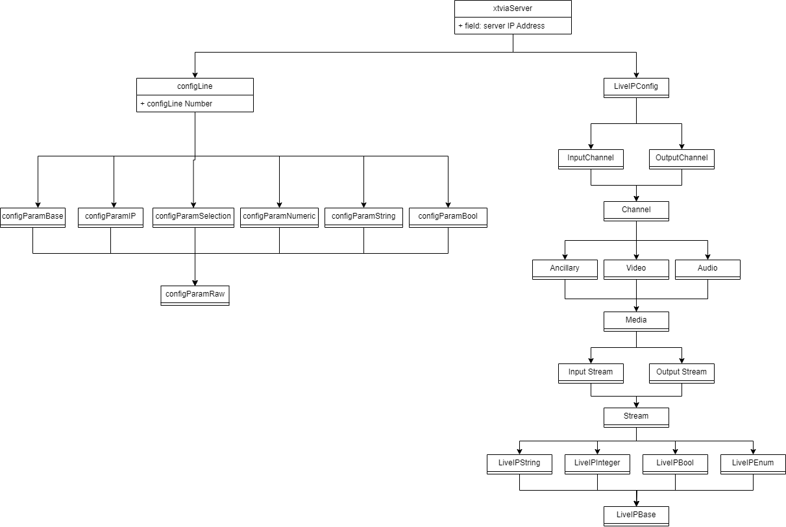

# GCV EVS Automation One Page

This is a simplified view of the entire project and focuses on the components and how they interact with the XT-VIA servers.

## Ansible

### Inventory Files

```yaml
xt-via:
  hosts:
    10.64.4.101:
    10.64.4.102:
    10.64.4.103:
    10.64.4.104:
    10.64.4.105:
    10.64.4.106:
    10.64.4.107:
    10.64.4.108:
    10.64.4.109:
    10.64.4.110:
    10.64.4.120:
x-files:
  hosts:
    10.64.4.61:
    10.64.4.62:

x-clients:
  hosts:
    10.64.44.201:
    10.64.44.202:
    10.64.44.203:
    10.64.44.204:
    10.64.44.205:
    10.64.44.206:
    10.64.44.207:
    10.64.44.208:
    10.64.44.209:
    10.64.44.210:
    10.64.44.211:
    10.64.44.212:


db-server:
  hosts:
    10.64.4.71:
    10.64.4.72:


xt-access:
  hosts:
    10.64.4.81:
    10.64.4.82:
    10.64.4.83:
    10.64.4.84:

ip-director:
  hosts:
    10.64.4.41:
    10.64.4.42:
    10.64.4.43:
    10.64.4.44:
    10.64.4.45:
    10.64.4.46:
```

### Playbooks

The playbooks are fairly simple, this is the most basic one.

```yaml
- name: EVS XT-VIA Setup and Config Playbook
  hosts: xt-via
  gather_facts: false
  vars:
    ansible_python_interpreter: "../../.venv/bin/python"
    options_path: " {{ repo_base_path }} /EVS- {{ serverNumber }} /NMOS/options.json" #This is where we store the EVS Config Files we save the options.json file fromo the server.
    serverNumber: " {{ inventory_hostname | regex_replace('^[0-9]{1,3}\\.[0-9]{1,3}\\.[0-9]{1,3}\\.\\d([0-9]{0,2})$', '\\1') }} " # Extract the server number from the IP, starting at 101 = 01 and 102 = 02...
    repo_base_path: /mnt/c/Users/jholmes/03_evs/Configs/ {{ project_name }}  # This is where we store the configs for the servers.

  roles:
    - role: evs-xt-via
      tags: ["setup"]
      delegate_to: 127.0.0.1
```

### evs-xt-via Role

This role is what runs all the tasks, it is not all the tasks, it imports them from other files to make organization easier. 

```yaml
# Tasks file for EVS XT-VIA Setup and Config

- name: Collect Info
  import_tasks: gather_info.yaml
  tags: ["info"]

- name: Check Basic Info
  import_tasks: check_server_info.yaml
  tags: ["server-info"]

- name: Pull Current Configs
  import_tasks: pull_config.yaml
  tags: ["pull-config"]

- name: Update Options JSON FEC
  import_tasks: set-fec.yaml
  tags: ["fec"]
  when: no_fec

- name: Name Config Lines
  import_tasks: config_name.yaml
  tags: ["config-name"]

- name: Config Line Server
  import_tasks: config_server.yaml
  tags: ["config-server"]

- name: Config Channels
  import_tasks: config_channels.yaml
  tags: ["config-channels"]

- name: Config Network
  import_tasks: config_network.yaml
  tags: ["config-network"]

- name: Config Monitoring
  import_tasks: config_monitoring.yaml
  tags: ["config-monitoring"]

- name: Config Protocols
  import_tasks: config_protocol.yaml
  tags: ["config-protocol"]

- name: Config GPI
  import_tasks: config_gpi.yaml
  tags: ["config-gpi"]

- name: Config Operation
  import_tasks: config_operation.yaml
  tags: ["config-operation"]

- name: Get Channel Count Info
  import_tasks: get_channel_count.yaml
  tags: ["channel-count"]

# LiveIP Section

- name: LiveIP Video Config Inputs
  import_tasks: liveip_inputs.yaml
  tags: ["liveIP", "liveIP-inputs"]

- name: LiveIP Video Config Inputs Mons
  import_tasks: liveip_inputs.yaml
  tags: ["liveIP", "liveIP-inputs", "liveIP-mons"]

- name: LiveIP Video Config Outputs
  import_tasks: liveip_outputs.yaml
  tags: ["liveIP", "liveIP-outputs"]

- name: LiveIP Video Config MV Inputs
  import_tasks: liveip_mv_inputs.yaml
  tags: ["liveIP", "liveIP-mv-inputs", "liveIP-mv"]

- name: LiveIP Video Config MV Outputs
  import_tasks: liveip_mv_outputs.yaml
  tags: ["liveIP", "liveIP-mv-outputs", "liveIP-mv"]

```


### Server Info Tasks

These are a few of the tasks that are using the evs_server module.

```yaml
---
- name: Set Facility Name
  evs_server:
    server_ip: " {{ inventory_hostname }} "
    facility_name: " {{ facility_name }} "
    session_id: " {{ evs_facts.session_id }} "
```


### Config Tasks

These are a few hand picks tasks to represent how we are setting config values. 
Many of these inherit from the default values file such as the defaul video codec is pulled from there.  

```yaml
---
- name: Configure Base Config
  evs_config:
    server_ip: " {{ inventory_hostname }} "
    session_id: " {{ evs_facts.session_id }} "
    line_number: " {{ config_line_number }} "
    config_parameter: "CFG_PARAM_BASE_CONFIG"
    config_value: " {{ base_config }} "


- name: Configure Video Interface
  evs_config:
    server_ip: " {{ inventory_hostname }} "
    session_id: " {{ evs_facts.session_id }} "
    line_number: " {{ config_line_number }} "
    config_parameter: "CFG_PARAM_VIDEO_3G_DUAL_MODE"
    config_value: " {{ video_interface }} "

- name: Configure Number of Ins
  evs_config:
    server_ip: " {{ inventory_hostname }} "
    session_id: " {{ evs_facts.session_id }} "
    line_number: " {{ config_line_number }} "
    config_parameter: "CFG_PARAM_NB_RECORDER"
    config_value: " {{ record_channels }} "

- name: Configure Ins Disk Use
  evs_config_disk_use:
    server_ip: " {{ inventory_hostname }} "
    session_id: " {{ evs_facts.session_id }} "
    line_number: " {{ config_line_number }} "
    channels_in: " {{ record_channels }} "

- name: Configure Number Of Outs
  evs_config:
    server_ip: " {{ inventory_hostname }} "
    session_id: " {{ evs_facts.session_id }} "
    line_number: " {{ config_line_number }} "
    config_parameter: "CFG_PARAM_NB_PLAYER"
    config_value: " {{ play_channels }} "
```


### LiveIP Tasks

These are a few LiveIP tasks that are using the evs_liveip module. These sections are a lot larger as there are more settings to get right for them. 

```yaml
---
# Main Input Stuff
- name: Set Live IP Input Video Enabled
  evs_liveip:
    server_ip: " {{ inventory_hostname }} "
    session_id: " {{ evs_facts.session_id }} "
    line_number: " {{ config_line_number }} "
    channel_direction: "inputs"
    channel_number: " {{ item }} "
    channel_type: "video"
    parameter: "enable"
    value: "true"
  loop: " {{ range(1, record_channels | int + 1) | list }} "
  tags: ["enable"]

- name: Set Live IP Input Video Multicast
  evs_liveip:
    server_ip: " {{ inventory_hostname }} "
    session_id: " {{ evs_facts.session_id }} "
    line_number: " {{ config_line_number }} "
    channel_direction: "inputs"
    channel_number: " {{ item }} "
    channel_type: "video"
    parameter: "dest_addr"
    value: " {{valid_out1_multicast}} "
  loop: " {{ range(1, record_channels | int + 1) | list }} "
  when: route_xt_via_input

- name: Set Live IP Input Video Destination Port
  evs_liveip:
    server_ip: " {{ inventory_hostname }} "
    session_id: " {{ evs_facts.session_id }} "
    line_number: " {{ config_line_number }} "
    channel_direction: "inputs"
    channel_number: " {{ item }} "
    channel_type: "video"
    parameter: "enable"
    value: " {{ xt_via_2110_ip_info['RX']['IN '+ '{:02}'.format(item) | string + '-01']['UDP_PORT'] }} "
  loop: " {{ range(1, record_channels | int + 1) | list }} "

# Audio G1

- name: Set Live IP Input Audio G1 Enabled
  evs_liveip:
    server_ip: " {{ inventory_hostname }} "
    session_id: " {{ evs_facts.session_id }} "
    line_number: " {{ config_line_number }} "
    channel_direction: "inputs"
    channel_number: " {{ item }} "
    channel_type: "audio_g1"
    parameter: "enable"
    value: "true"
  loop: " {{ range(1, record_channels | int + 1) | list }} "
  tags: ["enable"]
  

- name: Set Live IP Input Audio G1 Multicast
  evs_liveip:
    server_ip: " {{ inventory_hostname }} "
    session_id: " {{ evs_facts.session_id }} "
    line_number: " {{ config_line_number }} "
    channel_direction: "inputs"
    channel_number: " {{ item }} "
    channel_type: "audio_g1"
    parameter: "dest_addr"
    value: " {{valid_out1_multicast_audio_g1}} "
  loop: " {{ range(1, record_channels | int + 1) | list }} "
  when: route_xt_via_input

- name: Set Live IP Input Audio G1 Destination Port
  evs_liveip:
    server_ip: " {{ inventory_hostname }} "
    session_id: " {{ evs_facts.session_id }} "
    line_number: " {{ config_line_number }} "
    channel_direction: "inputs"
    channel_number: " {{ item }} "
    channel_type: "audio_g1"
    parameter: "enable"
    value: " {{ xt_via_2110_ip_info['RX']['IN '+ '{:02}'.format(item) + '-01']['UDP_PORT'] }} "
  loop: " {{ range(1, record_channels | int + 1) | list }} "

# Audio G2

- name: Set Live IP Input Audio G2 Enabled
  evs_liveip:
    server_ip: " {{ inventory_hostname }} "
    session_id: " {{ evs_facts.session_id }} "
    line_number: " {{ config_line_number }} "
    channel_direction: "inputs"
    channel_number: " {{ item }} "
    channel_type: "audio_g2"
    parameter: "enable"
    value: "true"
  loop: " {{ range(1, record_channels | int + 1) | list }} "
  tags: ["enable"]

- name: Set Live IP Input Audio G2 Multicast
  evs_liveip:
    server_ip: " {{ inventory_hostname }} "
    session_id: " {{ evs_facts.session_id }} "
    line_number: " {{ config_line_number }} "
    channel_direction: "inputs"
    channel_number: " {{ item }} "
    channel_type: "audio_g2"
    parameter: "dest_addr"
    value: " {{valid_out1_multicast_audio_g2}} "
  loop: " {{ range(1, record_channels | int + 1) | list }} "
  when: route_xt_via_input

- name: Set Live IP Input Audio G2 Destination Port
  evs_liveip:
    server_ip: " {{ inventory_hostname }} "
    session_id: " {{ evs_facts.session_id }} "
    line_number: " {{ config_line_number }} "
    channel_direction: "inputs"
    channel_number: " {{ item }} "
    channel_type: "audio_g2"
    parameter: "enable"
    value: " {{ xt_via_2110_ip_info['RX']['IN '+ '{:02}'.format(item) + '-01']['UDP_PORT'] }} "
  loop: " {{ range(1, record_channels | int + 1) | list }} "

# ANC

- name: Set Live IP Input ANC Enabled
  evs_liveip:
    server_ip: " {{ inventory_hostname }} "
    session_id: " {{ evs_facts.session_id }} "
    line_number: " {{ config_line_number }} "
    channel_direction: "inputs"
    channel_number: " {{ item }} "
    channel_type: "anc"
    parameter: "enable"
    value: "true"
  loop: " {{ range(1, record_channels | int + 1) | list }} "
  tags: ["enable"]

- name: Set Live IP Input ANC Multicast
  evs_liveip:
    server_ip: " {{ inventory_hostname }} "
    session_id: " {{ evs_facts.session_id }} "
    line_number: " {{ config_line_number }} "
    channel_direction: "inputs"
    channel_number: " {{ item }} "
    channel_type: "anc"
    parameter: "dest_addr"
    value: " {{valid_out1_multicast_anc}} "
  loop: " {{ range(1, record_channels | int + 1) | list }} "
  when: route_xt_via_input

- name: Set Live IP Input ANC Destination Port
  evs_liveip:
    server_ip: " {{ inventory_hostname }} "
    session_id: " {{ evs_facts.session_id }} "
    line_number: " {{ config_line_number }} "
    channel_direction: "inputs"
    channel_number: " {{ item }} "
    channel_type: "anc"
    parameter: "enable"
    value: " {{ xt_via_2110_ip_info['RX']['IN '+ '{:02}'.format(item) + '-01']['UDP_PORT'] }} "
  loop: " {{ range(1, record_channels | int + 1) | list }} "
  ```

  And some output ones

  ```yaml
  ---
# Video Output

- name: Set Live IP Output Video Enabled
  evs_liveip:
    server_ip: " {{ inventory_hostname }} "
    session_id: " {{ evs_facts.session_id }} "
    line_number: " {{ config_line_number }} "
    channel_direction: "outputs"
    channel_number: " {{ item }} "
    channel_type: "video"
    parameter: "enable"
    value: "true"
  loop: " {{ range(1, play_channels | int + 1) | list }} "
  tags: ["enable"]

- name: Set Live IP Output Video Multicast
  evs_liveip:
    server_ip: " {{ inventory_hostname }} "
    session_id: " {{ evs_facts.session_id }} "
    line_number: " {{ config_line_number }} "
    channel_direction: "outputs"
    channel_number: " {{ item }} "
    channel_type: "video"
    parameter: "dest_addr"
    value: " {{ xt_via_2110_ip_info['TX']['CLEAN OUT '+ '{:02}'.format(item) ]['VIDEO_PURPLE'] }} "
  loop: " {{ range(1, play_channels | int + 1) | list }} "
  

- name: Set Live IP Output Video Destination Port
  evs_liveip:
    server_ip: " {{ inventory_hostname }} "
    session_id: " {{ evs_facts.session_id }} "
    line_number: " {{ config_line_number }} "
    channel_direction: "outputs"
    channel_number: " {{ item }} "
    channel_type: "video"
    parameter: "enable"
    value: " {{ xt_via_2110_ip_info['TX']['CLEAN OUT '+ '{:02}'.format(item) ]['UDP_PORT'] }} "
  loop: " {{ range(1, play_channels | int + 1) | list }} "

# Audio G1 Output

- name: Set Live IP Output Video Enabled
  evs_liveip:
    server_ip: " {{ inventory_hostname }} "
    session_id: " {{ evs_facts.session_id }} "
    line_number: " {{ config_line_number }} "
    channel_direction: "outputs"
    channel_number: " {{ item }} "
    channel_type: "audio_g1"
    parameter: "enable"
    value: "true"
  loop: " {{ range(1, play_channels | int + 1) | list }} "
  tags: ["enable"]

- name: Set Live IP Output Video Multicast
  evs_liveip:
    server_ip: " {{ inventory_hostname }} "
    session_id: " {{ evs_facts.session_id }} "
    line_number: " {{ config_line_number }} "
    channel_direction: "outputs"
    channel_number: " {{ item }} "
    channel_type: "audio_g1"
    parameter: "dest_addr"
    value: " {{ xt_via_2110_ip_info['TX']['CLEAN OUT '+ '{:02}'.format(item) ]['AUDIO_G1_PURPLE'] }} "
  loop: " {{ range(1, play_channels | int + 1) | list }} "
  

- name: Set Live IP Output Video Destination Port
  evs_liveip:
    server_ip: " {{ inventory_hostname }} "
    session_id: " {{ evs_facts.session_id }} "
    line_number: " {{ config_line_number }} "
    channel_direction: "outputs"
    channel_number: " {{ item }} "
    channel_type: "audio_g1"
    parameter: "enable"
    value: " {{ xt_via_2110_ip_info['TX']['CLEAN OUT '+ '{:02}'.format(item) ]['UDP_PORT'] }} "
  loop: " {{ range(1, play_channels | int + 1) | list }} "

  # Audio G2 Output

- name: Set Live IP Output Video Enabled
  evs_liveip:
    server_ip: " {{ inventory_hostname }} "
    session_id: " {{ evs_facts.session_id }} "
    line_number: " {{ config_line_number }} "
    channel_direction: "outputs"
    channel_number: " {{ item }} "
    channel_type: "audio_g2"
    parameter: "enable"
    value: "true"
  loop: " {{ range(1, play_channels | int + 1) | list }} "
  tags: ["enable"]

- name: Set Live IP Output Video Multicast
  evs_liveip:
    server_ip: " {{ inventory_hostname }} "
    session_id: " {{ evs_facts.session_id }} "
    line_number: " {{ config_line_number }} "
    channel_direction: "outputs"
    channel_number: " {{ item }} "
    channel_type: "audio_g2"
    parameter: "dest_addr"
    value: " {{ xt_via_2110_ip_info['TX']['CLEAN OUT '+ '{:02}'.format(item) ]['AUDIO_G2_PURPLE'] }} "
  loop: " {{ range(1, play_channels | int + 1) | list }} "
  

- name: Set Live IP Output Video Destination Port
  evs_liveip:
    server_ip: " {{ inventory_hostname }} "
    session_id: " {{ evs_facts.session_id }} "
    line_number: " {{ config_line_number }} "
    channel_direction: "outputs"
    channel_number: " {{ item }} "
    channel_type: "audio_g2"
    parameter: "enable"
    value: " {{ xt_via_2110_ip_info['TX']['CLEAN OUT '+ '{:02}'.format(item) ]['UDP_PORT'] }} "
  loop: " {{ range(1, play_channels | int + 1) | list }} "

# ANC Output

- name: Set Live IP Output Video Enabled
  evs_liveip:
    server_ip: " {{ inventory_hostname }} "
    session_id: " {{ evs_facts.session_id }} "
    line_number: " {{ config_line_number }} "
    channel_direction: "outputs"
    channel_number: " {{ item }} "
    channel_type: "anc"
    parameter: "enable"
    value: "true"
  loop: " {{ range(1, play_channels | int + 1) | list }} "
  tags: ["enable"]

- name: Set Live IP Output Video Multicast
  evs_liveip:
    server_ip: " {{ inventory_hostname }} "
    session_id: " {{ evs_facts.session_id }} "
    line_number: " {{ config_line_number }} "
    channel_direction: "outputs"
    channel_number: " {{ item }} "
    channel_type: "anc"
    parameter: "dest_addr"
    value: " {{ xt_via_2110_ip_info['TX']['CLEAN OUT '+ '{:02}'.format(item) ]['ANC_PURPLE'] }} "
  loop: " {{ range(1, play_channels | int + 1) | list }} "
  

- name: Set Live IP Output Video Destination Port
  evs_liveip:
    server_ip: " {{ inventory_hostname }} "
    session_id: " {{ evs_facts.session_id }} "
    line_number: " {{ config_line_number }} "
    channel_direction: "outputs"
    channel_number: " {{ item }} "
    channel_type: "anc"
    parameter: "enable"
    value: " {{ xt_via_2110_ip_info['TX']['CLEAN OUT '+ '{:02}'.format(item) ]['UDP_PORT'] }} "
  loop: " {{ range(1, play_channels | int + 1) | list }} "

  ```

### Live IP Options

This is to handle settings like the PTP Domain which I do not have a great way to build into the noraml class structure. 

```yaml
- name: Set PTP Domain
  evs_liveip_raw:
    server_ip: " {{ inventory_hostname }} "
    session_id: " {{ evs_facts.session_id }} "
    line_number: " {{ config_line_number }} "
    uri: "/liveip/ptp/domain"
    value: " {{ ptp_domain }} "
- name: Set Audio Packet Timing
  evs_liveip_raw:
    server_ip: " {{ inventory_hostname }} "
    session_id: " {{ evs_facts.session_id }} "
    line_number: " {{ config_line_number }} "
    uri: "/liveip/aes67/packettime"
    value: "125"
```

## Ansible Modules

### evs_server - Ansible Python Module

This module is designed mostly to set the facility name of a server, its not incredibly useful for anything else..


```python
def run_module():
    # define available arguments/parameters a user can pass to the module
    module_args = dict(
        server_ip=dict(type="str", required=True),
        facility_name=dict(type="str", required=True),
        session_id=dict(type="str", required=False, default="Reset"),
    )
    # seed the result dict in the object
    module = AnsibleModule(argument_spec=module_args, supports_check_mode=True)

    # This builds the server object and tells it to do minimal inspection
    via = xtvia.xtviaServer(
        module.params["server_ip"],
        [],
        inspection=2,
        sessionID=module.params["session_id"],
    )
    # We can see if the facility name matches the one passed in or not here. 
    result = dict(changed=(via.get_facility_name() != module.params["facility_name"]))
    
    # Only updates the facility name if we are not in check mode
    if module.check_mode:
        module.exit_json(**result)
    else:
        via.set_facility_name(module.params["facility_name"])
        module.exit_json(**result)


def main():
    run_module()


```

### evs_config - Ansible Python Module

This is how we call the evsApi in python to make changes and gather information. 

```python
def run_module():
    # define available arguments/parameters a user can pass to the module
    module_args = dict(
        server_ip=dict(type="str", required=True),
        session_id=dict(type="str", required=False, default="Reset"),
        line_number=dict(type="int", required=False),
        config_parameter=dict(type="str", required=False),
        config_value=dict(type="str", required=False),
    )
    # seed the result dict in the object
    module = AnsibleModule(argument_spec=module_args, supports_check_mode=True)

    # This builds the server object and tells it to do minimal inspection
    via = xtvia.xtviaServer(
        module.params["server_ip"],
        [module.params["line_number"]],
        inspection=2,
        singleParam=module.params["config_parameter"],
        sessionID=module.params["session_id"],
    )

    # Get the config line information and drill down to the parameter.
    cfgLine = via.get_config(module.params["line_number"])
    cfgParm = cfgLine.get_param(module.params["config_parameter"])

    # This is what tells us if the parameter has changed or not.
    changed = cfgParm.getCurrentLabel() != module.params["config_value"]

    # Our result back to Ansible.
    result = dict(
        changed=changed, current_value=cfgParm.getCurrentValue(), intended_value=module.params["config_value"]
    )

    # Only Updates the paramter if we are not just checking it.
    if module.check_mode:
        module.exit_json(**result)
    else:
        cfgParm.setCurrentValue(module.params["config_value"])
        module.exit_json(**result)


def main():
    run_module()
```

### evs_liveip - Ansible Python Module

This module needed a bit of extra work to make it support the uri based parameters. For the purposes of not making this document too long, I am only going to show the code for checking an input video is enbabled.

```python
def run_module():
    # define available arguments/parameters a user can pass to the module
    module_args = dict(
        server_ip=dict(type="str", required=True),
        session_id=dict(type="str", required=False, default="Reset"),
        line_number=dict(type="int", required=True),
        channel_direction=dict(type="str", required=True),
        channel_number=dict(type="int", required=True),
        channel_type=dict(type="str", required=True),
        parameter=dict(type="str", required=True),
        value=dict(type="str", required=True),
    )

    # channel_direction is going to be expecting on of the following ["inputs", "outputs", "mv_inputs", "mv_outputs"]

    module = AnsibleModule(argument_spec=module_args, supports_check_mode=True)

    # Going to checkout Things.
    via = xtvia.xtviaServer(
        module.params["server_ip"],
        [module.params["line_number"]],
        inspection=2,
        getLiveIPs=True,
    )
    liveIPStruct: LiveIPConfig = via.get_liveip(module.params["line_number"])

    match module.params["channel_direction"]:
        case "inputs":
            channel: Channel = liveIPStruct.getInput(module.params["channel_number"])

    # We have a handling for the channel object now.
    # Luckily the channel types are nearly identical from our perspective, so this should be easier.
    signal: Media
    match module.params["channel_type"]:
        case "video":
            signal = channel.get_video(1)


    # Now we have a signal in the form of the Media class that should have all the standard functions we need.
    # If using redundant we need to do some extra work but here we will just move on.
    stream: Stream = signal.get_stream()
    changed: bool = False

    if module.params["parameter"] in ["enabled", "enable"]:
        curVal = str(stream.get_enabled()).lower()
        if curVal != str(module.params["value"]).lower():
            changed = True
        if not module.check_mode:
            stream.set_enabled(str(module.params["value"]).lower())

    result = dict(changed=changed, current_value=curVal, intended_value=module.params["value"])
    module.exit_json(**result)


def main():
    run_module()
```

## evsApi - Python Module

This is the hear of the program it uses python classes to handle most of it, but it also deals with the http request to the server. Here is the overall structure of the classes.



This whole module uses wrapper `get_request` and `post_request` to the server, which includes parameters such as the `sessionID` and `lineNumber`. 

### Get Multicam Info

This function is what gets the basic information abou the server like version, serial number, hardware revision, etc.

```python 
    def _get_multicam_info(self) -> dict:
        """Gets the Multicam Info from the Server.

        Args:
            serverIP (str): IP address of the server you want to get info about.

        Returns:
            dict: A large dictionary containing all the info you could ever want.
        """

        # This is the only instance where it is appropriate to ignore the getSessionID() function, but since it could cause a loop I figure this is better.
        parms = {"SessionID": self._sessionID}
        url = f"http://{self._serverIP}/cfgweb/CfgWeb.dll/MulticamInfoJS"

        try:
            data = self._get_request(url, parms)
            self._facilityName = data["FacilityName"]
            self._chassis = data["Chassis"]
            self._version = data["Version"]
            self._SN = data["SN"]
            self._technicalLocked = data["IsTechnicalLocked"]
            self._HWEdition = data["HWEdition"]
            self._sessionID = data["SessionID"]
            self._latestMCInfo = data
            self._lastUpdateTS = datetime.datetime.now()
            return data
        except Exception as e:
            raise e
```

### Get Confline Information

These functions are how we gather infrormation about the servers entire configline and then single parameters. 

```python
    def _get_configLine_all(self, numLine: int) -> dict:
        """Gets all config line information, mostly the keys and current values, it does not give us indepth information such as allowed values. This is used for getting the list of config lines.

        Args:
            numLine (int): Number of the config line you want to get info about.

        Returns:
            dict: Configline Data as a dictionary.
        """
        parms = {"SessionID": self._get_SessionID(), "NumLine": numLine, "Meta": True, "All": True}
        url = f"http://{self._serverIP}/cfgweb/CfgWeb.dll/GetConfigValuesJS"

        data = self._get_request(url, parms)

        return data

    def _get_configLine_param(self, param: str, numLine: int) -> str:
        """Gets a single parameter of a config Line, this is useful to get all the information about a parameter which includes the allowed values.

        Args:
            param (str): _description_
            numLine (int): _description_

        Returns:
            str: _description_
        """
        parms = {"SessionID": self._get_SessionID(False), "NumLine": numLine, "ParamName": param, "List": True}
        url = f"http://{self._serverIP}/cfgweb/CfgWeb.dll/ParamDescriptorJS"

        logger.debug(f"Getting description for {param} at line {numLine}")

        data = self._get_request(url, parms)

        return data
```

### Setting Configline Parameters

This is how we are setting a config line parameter. By passing in the configline number, the parameter name, and the value we want to set it to.

```python
    def _update_configLine(self, numLine: int, cfgName: str, cfgValue: Any, save: bool = True) -> dict:
        """This sets a single paramter in a single config line, its not the most efficient thing but it works well. This has minimal intelgence for allowed values, that should happen in the config parameter class. This is used for setting the config line to a specific value.

        Args:
            numLine (int): Number of the config line you want to update.
            cfgName (str): Config Name, or Key, of the parameter you want to update.
            cfgValue (Any): The value you want to set it to, this supports any type becuase some values are ints and strings.
            save (bool, optional): This is whether you want to save it, this is current for future support, there isn't a great way to actually track changes this way. Defaults to True.

        Returns:
            dict: The respnse from the server.
        """
        params: dict = {
            cfgName: cfgValue,
            "NumLine": numLine,
            "SessionID": self._get_SessionID(),
            "Commit": save,
            "Save": save,
        }
        url = f"http://{self._serverIP}/cfgweb/CfgWeb.dll/SetConfigValuesJS"

        data = self._get_request(url, params)

        return data
```

### Getting Live IP Information

This gets me the bulk of the Live IP config information and is very useful because all the data is return in one request. It is also how we handle changing the config line number through sessions. 

```python
    def _set_liveIP_cfglineNum(self, num: int) -> dict:
        """Sets the sessions current config line number this is important to call before most things.

        Args:
            num (int): _description_

        Returns:
            dict: _description_
        """

        # Added a check to see if we are already setup correctly.
        if self._currentLiveIPFocus == num:
            return {"success": True}
        else:

            params = {
                "SessionID": self._get_SessionID(False),
                "number": num,
            }
            url = f"http://{self._serverIP}/ipconfigurationweb/setlinenumberactionjs"

            data = self._get_request(url, params)

            self._currentLiveIPFocus = num

            logger.debug(f"Updated Live IP Config Line Number to {num}")

        return data

        s
    def _get_liveip_all(self) -> dict:
        """This just makes the ask for all the liveIP config lines. Since it is session based you need to have set the config line number you wanted before this.

        Returns:
            dict: _description_
        """
        params = {
            "SessionID": self._get_SessionID(False),
        }
        url = f"http://{self._serverIP}/ipconfigurationweb/getsubtreeactionjs"

        data = self._get_request(url, params)

        return data
```

### Setting and Saving Live IP Parameters

This is how we set and save the live IP parameters.

```python
    def _set_liveip_one(self, numLine: int, uri: str, value: Any) -> dict:
        """This sets a single parameter in the currentl session config line.

        Args:
            numLine (int): Config Line Number
            uri (str): URI of the parameter you want to set.
            value (Any): Value of the parameter you want to set.

        Returns:
            dict: Response from the server.
        """
        if not self._get_multicam_info()["IsMulticamRunning"]:
            self._set_liveIP_cfglineNum(numLine)

        params = {"SessionID": self._get_SessionID(False)}

        data = {"uri": uri, "value": value}
        url = f"http://{self._serverIP}/ipconfigurationweb/setparametervalueactionjs"
        response = self._post_request(url, params, data)

        self._commit_liveIP()

        return response

    def _commit_liveIP(self) -> dict:
        """This just executes the commit action on the current config line.

        Returns:
            dict: Response from the server.
        """
        params = {"SessionID": self._get_SessionID(False)}
        url = f"http://{self._serverIP}/ipconfigurationweb/commitactionjs"
        data = self._get_request(url, params)
        return data
```